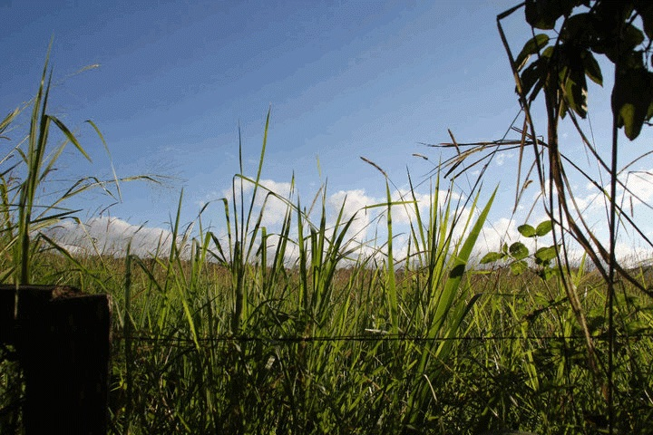
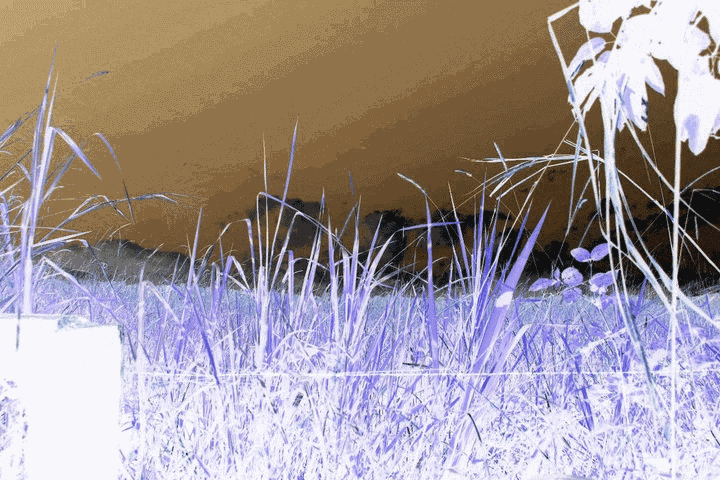
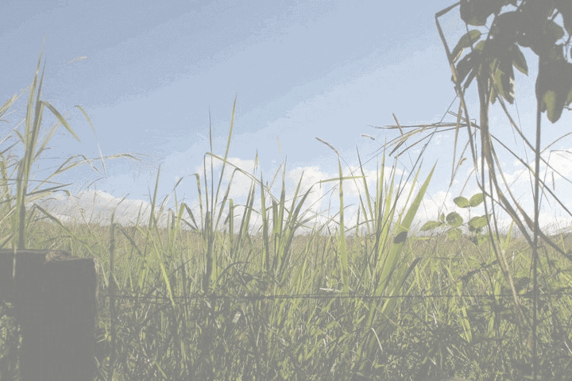
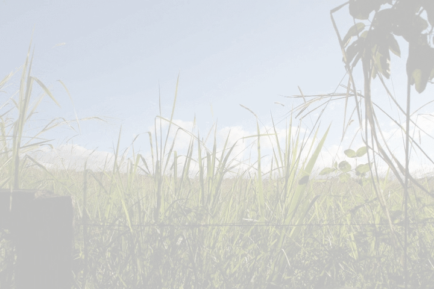
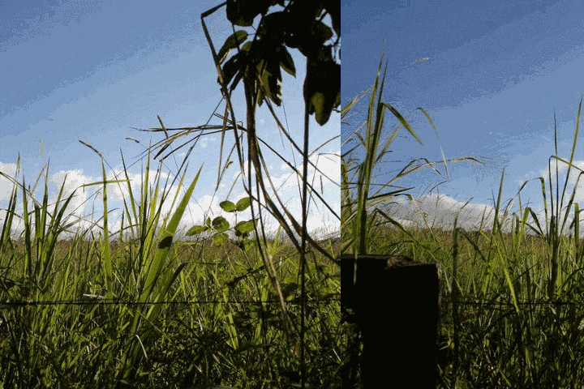

Participation Exercise
======================

### Due Tuesday, October 4, 2016 - 5:00pm

This assignment will be a graded in-class exercise. You are required to submit your work by 5:00pm on October 4, 2016. The assignment will be worth 10 points and will count toward the "Participation and Quizzes" portion of your final grade.

##Requirements
For this assignment, you will implement several methods that manipulate jpg images. 

Download the following java files: 

- [ImageManipulator.java](exercise10_4/ImageManipulator.java)
- [ImageTester.java](exercise10_4/ImageTester.java)
- [Picture.java](exercise10_4/Picture.java)
- [Pixel.java](exercise10_4/Pixel.java)

Complete all methods as described in the documentation of [ImageManipulator.java](exercise10_4/ImageManipulator.java). 

You **should not** modify any of the code in the other three classes.

For full credit, your submission must pass all of the tests in the class [ImageTester.java](exercise10_4/ImageTester.java) by producing images that look as follows:

#### Original

#### Negative

#### Lighter

#### Lightest

#### Scroll Horizontal

### Submission Requirements

1. For this assignment, you will submit the following files: `ImageManipulator.java`. 

2. Make sure your code follows all requirements in the [Style Guidelines](https://github.com/CS112-F16/notes/blob/master/style.md).

3. Follow the instructions in the [SVN Guide](https://github.com/CS112-F16/notes/blob/master/svn_guide.md) for submitting your solution by the deadline.

4. Make sure you have submitted your work in an SVN directory: `https://www.cs.usfca.edu/svn/<username>/cs112/exercises`

